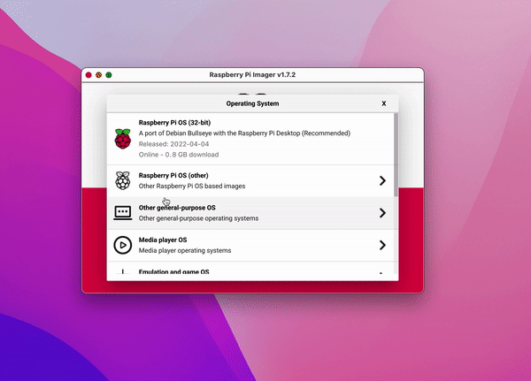

# Home Security Object Detection

## Description
This repo contains a project using a Raspberry pi, Django and a Tensorflow
pretrained Model to create a local webserver displaying camera footage 
from the raspberry pi. The camera feed is being augmented by the Tensorflow Object detection model. Any recognized objects will be recorded for the time they appear on screen. We can designate what we would like to record through the web app interface. The recordings are saved locally to the Pi and are available to be downloaded on the client side.


## Requirements
### Hardware
- Raspberry pi 4
- OS (or raspberry equivalent):
```
	Distributor ID:	Debian
	Description:	Debian GNU/Linux 11 (bullseye)
	Release:	11
	Codename:	bullseye
	
	aarch64
	Linux raspberrypi 5.15.32-v8+ #1538 SMP PREEMPT Thu Mar 31 19:40:39 BST 2022 aarch64 GNU/Linux
```


- [Connect Pi to monitor HDMI](https://www.amazon.com/Adapter-Graphic-Samsung-Android-Function/dp/B09PQL1MBQ/ref=sr_1_5?crid=2SW1PZQVRATWY&keywords=hdmi+to+micro+usb&qid=1659813415&sprefix=hdmi+to+micro+usb%2Caps%2C120&sr=8-5)


- [MicroSD with adaptor](https://www.amazon.com/SAMSUNG-Select-microSDXC-Adapter-MB-ME64HA/dp/B08879MG33/ref=sr_1_2?crid=2O7IZ8MNPYOHE&keywords=Samsung’s+64GB+EVO+Select&qid=1659810940&s=electronics&sprefix=samsung+s+64gb+evo+select+%2Celectronics%2C255&sr=1-2)


- [Raspberry Pi 4 Model B Official PSU, USB-C, 5.1V, 3A, US Plug, Black SC0218 Pi Accessory (KSA-15E-051300HU)](https://www.amazon.com/gp/product/B07W8XHMJZ/ref=ppx_yo_dt_b_asin_title_o04_s00?ie=UTF8&psc=1)


- [Raspberry Pi 4 Model B 2019 Quad Core 64 Bit WiFi Bluetooth (4GB)](https://www.amazon.com/gp/product/B07TC2BK1X/ref=ppx_yo_dt_b_asin_title_o03_s00?ie=UTF8&psc=1)


 
- [Infared Camera](https://www.amazon.com/dp/B07BK1QZ2L?psc=1&ref=ppx_yo2ov_dt_b_product_details)


### Optional Hardware

#### SEE ASSEMBLY


 
- [Battery](https://www.amazon.com/gp/product/B0788B9YGW/ref=ppx_yo_dt_b_asin_image_o01_s00?ie=UTF8&psc=1)


 
- [Case](https://www.amazon.com/gp/product/B07WPLDVQJ/ref=ppx_yo_dt_b_asin_image_o09_s00?ie=UTF8&th=1)


### Software
- `curl https://pyenv.run | bash (pyenv installation)`
- python 3.8.8 (we will install with virual penv)
- python3 -m pip install tflite-runtime (we will install in the virtual env)
- django (install into venv)
- opencv-python (install into venv)

# Instalation Guide
## Pi OS
1 .Visit Raspberry Pi website to download an imager for your operating system [Download from here](https://www.raspberrypi.com/software/)
Once you have done that you can insert the sd card into your computer and launch the application


2. Select Your Desired OS, I am using Raspberry Pi OS (64-bit) with desktop for this project and the storage device you inserted



3. Select the write button and wait for you os to download!
4. Once done, safely eject your sd adapter. Remove the SD card from the adapter and place into the raspberry pi


## Assembly
If you are using the case provided in this tutorial and the battery you will need to make some minor adjustments to the legs of the battery
1. Attach camera to Pi via the camera port. Top open it gently grip the black sides of the port and pull up. This will expose a small opening where you will place the camera strip matching stripes to stripes. If you are using the battery it might be better to do this part before placing the battery


## First Set Up
This tutorial shows us how to set up our Pi using a monitor. We will later go into ssh-ing into the pi and using the already installed vnc viewer server. But you can edit the config files so that you are free to ssh before the initial set up check it out! [ssh into pi before set up](https://www.tomshardware.com/reviews/raspberry-pi-headless-setup-how-to,6028.html)

1. Once you have inserted the sd card you can plug your raspberry Pi into a power unit then using your hdmi adapter you can plug it into the moniter. Using the USB slots you can plug in your mouse and key board.
2. 

