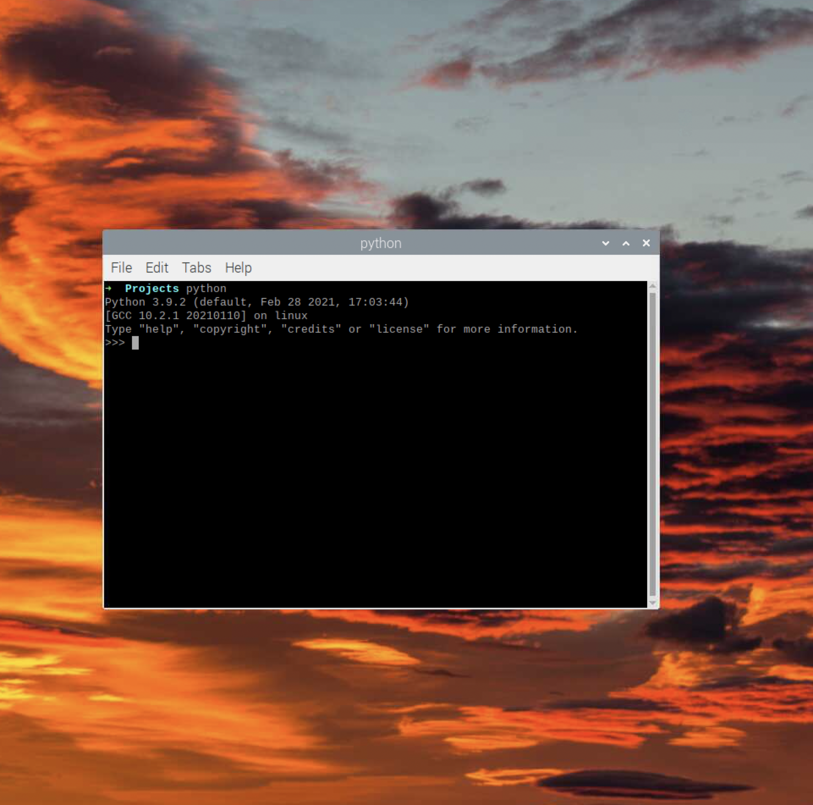
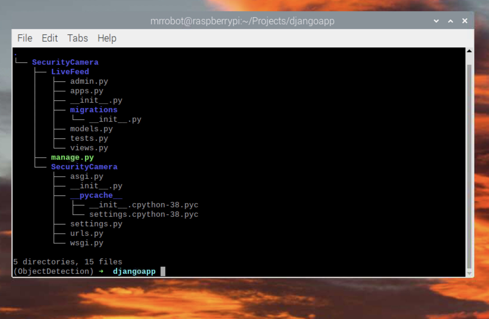
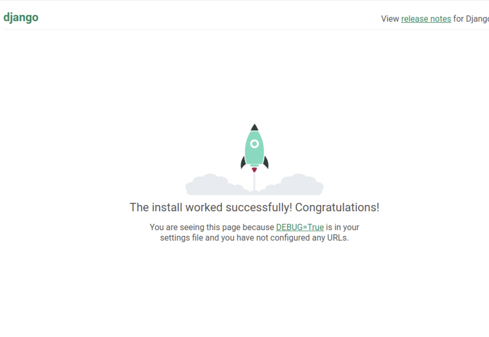

# zsh and oh-my-zsh (Optional)

zsh and oh-my-zsh are not mandatory dependencies but do make the terminal a bit easier to navigate.
To install go ahead and run the following commands in the terminal.
The first will install zsh or the Z-Shell
next it will install git (if not already installed)
finally it will clone the oh-my-zsh repo and set it as our default shell.
You will need to reboot for this to take effect everytime you open the shell

```
sudo apt install zsh
sudo apt install curl wget git
sh -c "$(curl -fsSL https://raw.github.com/ohmyzsh/ohmyzsh/master/tools/install.sh)"
git clone git@github.com:zsh-users/zsh-syntax-highlighting.git`
echo "source ${(q-)PWD}/zsh-syntax-highlighting/zsh-syntax-highlighting.zsh" >> ${ZDOTDIR:-$HOME}/.zshrc
source ./zsh-syntax-highlighting/zsh-syntax-highlighting.zsh
chsh -s $(which zsh)
```

# Python installation
now lets set up our project we will use this structure:
```
Projects
└── djangoapp
```
in the shell enter the following commands:
```
cd
mkdir Projects
cd Projects
mkdir djangoapp
```
This will make a new directory/folder in your Home folder and move into that directory. After which it will
create an empty directory in the current Projects folder called djangoapp


Now lets install pyenv and add it to our PATH to help us manage different versions of python when we need to.

pyenv dependencies:
```
sudo apt update
sudo apt install \
build-essential \
curl \
libbz2-dev \
libffi-dev \
liblzma-dev \
libncursesw5-dev \
libreadline-dev \
libsqlite3-dev \
libssl-dev \
libxml2-dev \
libxmlsec1-dev \
llvm \
make \
tk-dev \
wget \
xz-utils \
zlib1g-dev \
libbluetooth-dev
```
pyenv
```
curl https://pyenv.run | bash
echo 'export PATH="$HOME/.pyenv/bin:$PATH"
eval "$(pyenv init -)"
eval "$(pyenv virtualenv-init -)"' >> ~/.bashrc 
```
if you are using the zsh terminal then change the last line from `>> ~/.bashrc` to `>> ~/.zshrc`
exit and restart the terminal.
ensure pyenv has installed correctly by entering
`pyenv`
into the terminal. You should see an output similar to the following:


navigate back to out Projects directory using the `cd` command
next we will install python version 3.8.8 using pyenv so we can use Tensorflow and Django (this might take a minute)

`pyenv install 3.8.8`

Next we will move into our django app directory with the command

`cd djangoapp`

Now with the following command we will designate this directory and every subdirectory to use python 3.8.8
```
pyenv virtualenv 3.8.8 ObjectDetection
pyenv local ObjectDetection
```
You will notice that your terminal prompt has changed to show you are in the virtual environment


if you move up one directory using `cd ..` you will see that the prompt reverts back to normal to show that you are out of the venv


Launching python outside of the venv will run your system python



while launching python in your djangoapp directory will use python 3.8.8


Note that installing with pip will install to the python currently in scope.
to install python dependencies to our 3.8.8 we need to be in that folder

Now that this is completed its time to install django and tensorflow lite.
Make sure you are in the djangoapp/ObjectDetection directory and run the following commands
```
python3 -m pip install tflite-runtime
python3 -m pip install Django
python3 -m pip install opencv-python
```

- tflite-runtime will be how we interact with a pretrained Tensorflow Object detection model
- Django will be what we use to set up out webserver
- opencv will be used to interact with the webcam


# Django
Now that we have our dependancies squared away we can begin developing our django project.
In our venv we will run the command below (I chose to name the project SecurityCamera but you can name it whatever youd like)

`python3 -m django startproject SecurityCamera`

This will create a new django web application template for us.


There is a new directory below the orignal of the same name containing some important files.
asgi.py and wsgi.py will not be used in this tutorial But once you are ready to package a django application to be hosted on 
the world wide web youll need to learn more about these.
The __init__.py designates this directory as a python module, not sure why but Im sure it has to do with how Django operates.
It is an empty file that we will leave alone. The manage.py file we will use alot! this file, you guessed it, helps us manage our django application(s)/modules. We only add one module project but it is worth noteing that you can have multiple in the same project.
We will do this by using the manage.py file and the command startapp as below (make sure you are in the same directory as manage.py when you run this command):

`python manage.py startapp LiveFeed`

Now there is a new folder inside our SecurityCamera Project called LiveFeed.



models.py helps us abstract data such as forms or users. Instead of writing database scripts we can use models to model real life data
we can easily define a user with certain permissions, or a valid form to be taken from the front end. We will not be using models in this tutorial
but its good to know!

[More On Models](https://docs.djangoproject.com/en/4.0/topics/db/models/)

admin.py is similar in that it holds models but these are only relevant to administrators

[More On admin.py](https://docs.djangoproject.com/en/4.0/ref/contrib/admin/)

tests.py is very usefull when running tests against your website. Test scenarios can ca nbe written for specific apps
and then run through the manage.py interface

[More On test.py](https://docs.djangoproject.com/en/4.0/topics/testing/overview/)

Next up is apps.py which helps us set some configurations for our particular app

[More On appys.py](https://docs.djangoproject.com/en/4.1/ref/applications/#application-configuration)

Finally 

We have views.py, This helps us display webpages/views from our application. We will mainly be focusing on this portion for our project.

In the terminal enter the following command:

`python manage.py runserver`

You will see a url pop up. Go to it in your Raspberry pi and you should find the django starting page



Go ahead and enter CNTRL+C in the terminal to close the webserver
Next checkout the tensorflow_integration module to see how we can use tensorflow lite and a pretrained model
to detect Objects using our raspberry pi + camera
