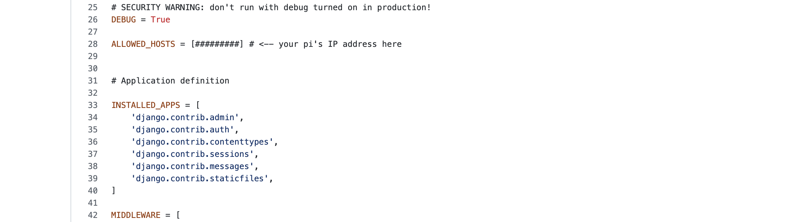
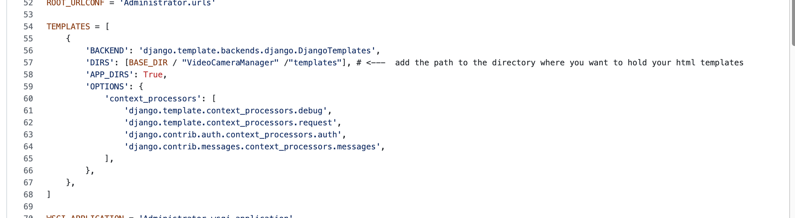
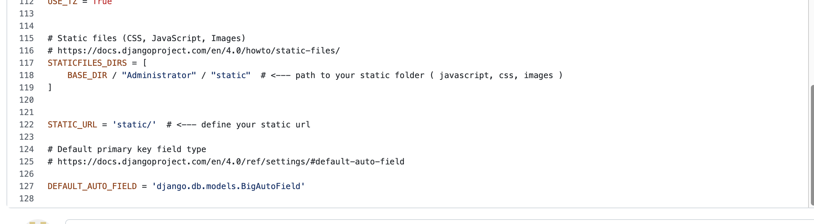

# Putting it all together

You can use the Administrator folder as a template or just download it yourself.

regardless you will have to do some work in a few areas.

First we will start with the settings.py file. It is a file within the folder created for you when you ran
the django startproject command (not the django startapp one). It should have the same name as the parent folder.

In your settings.py we need to whitelist your raspberry pi's IP as a valid host so that you can host it on your local network

change the list above from [#######] to [1.4.26.452] <- your pi's ip
You can also whitelist mutiple hosts [ip1, ip2]

Next in the same file we will designate a folder where our html templates will be held.

Notice how we are using the BASE_DIR variable which relates the the base folder of our entire project.
Same folder as the manage.py. we use the "/"  with out quotes to represent a subfolder. In this case I am keeping the template html files
for my VideoCameraManager app within my VideoCameraManager app, so the path is` BASE DIR /"VideoCameraManager" /"templates"` .
notice how the path is between brackets. This means it is a list and we can add other template directories to that list as we see fit.

This is the django server structure with the and implemented tf object detection model and web interface.
inside of the Administrator/VideoCameraManager app you will find a folder called `stream` This is a python module
to manage our object detection and streaming.
