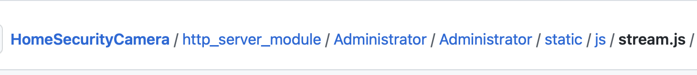
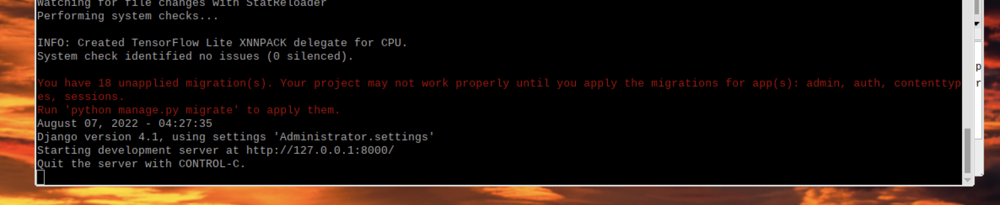
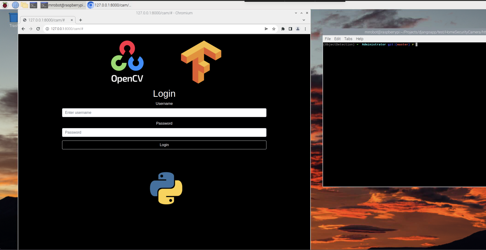

# Putting it all together

You can use the Administrator folder as a template or just download it yourself.

regardless you will have to do some work in a few areas.

First we will go into the static folder located in the path Administrator/static/js/stream.js. There you will repalce
the placeholder <your_ip_address>:<your_port_number> with your Pis IP and port hosting the webserver

Next we will change the settings.py file. It is a file within the folder created for you when you ran
the django startproject command (not the django startapp one). It should have the same name as the parent folder.

In your settings.py we need to whitelist your raspberry pi's IP as a valid host so that you can host it on your local network

change the list above from [#######] to ["1.4.26.452"] <- your pi's ip
You can also whitelist mutiple hosts ["ip1", "ip2"]

Next in the same file we will designate a folder where our html templates will be held.

Notice how we are using the BASE_DIR variable which relates the the base folder of our entire project.
Same folder as the manage.py. We use the "/"  without quotes to represent a subfolder. In this case I am keeping the template html files
for my VideoCameraManager app within my VideoCameraManager app, so the path is` BASE DIR /"VideoCameraManager" /"templates"` .
notice how the path is between brackets. This means it is a list and we can add other template directories to that list as we see fit.

Next part in the setting.py that needs to be defined is the static directory. This is where we will hold all of our Javascript, Css and images folders
I am keeping mine in the directory holding the setting.py file feel free to do the same. I am also leaving the static url as "static/".

now that we have done this part lets try and run the server.

`python3 manage.py runserver <your_ip_address>:8000` (we will be running the command this way as of now so that Javascript and the backend can comunicate)

if you see the message above not to worry.
Close the server with CNTRL-C then
In the same directory as you manage.py and run the command displayed:

`python manage.py migrate`

I had a strange issue where the process hung. If it hangs go ahead and CNTR-C to exit then run the runserver command again

`python3 manage.py runserver <your_ip_address>:8000`

the warning should be gone.

If you used the template from the repo you should be able to got to 

## Final notes

now we will start the server with a different version of the command

`python3 manage.py runserver<your_ip_address>:8000`

to find a login page. Only you wont be able to log in.

close the server with CNTRL-C and run the following command

`python manage.py createsuperuser`

this will prompt you to create a super user. 

If you are not using the template above youll still want to do this portion

Once you have created the super user go ahead and login.

Now that you have logged in go ahead and test it out.

The log will show when it starts recording and when it end. At this point the script is set up to
save all the logs and videos in the stream folder within the VideoCameraFolder.

The destination can be changed by modifying the constants.py file within the stream folder.

