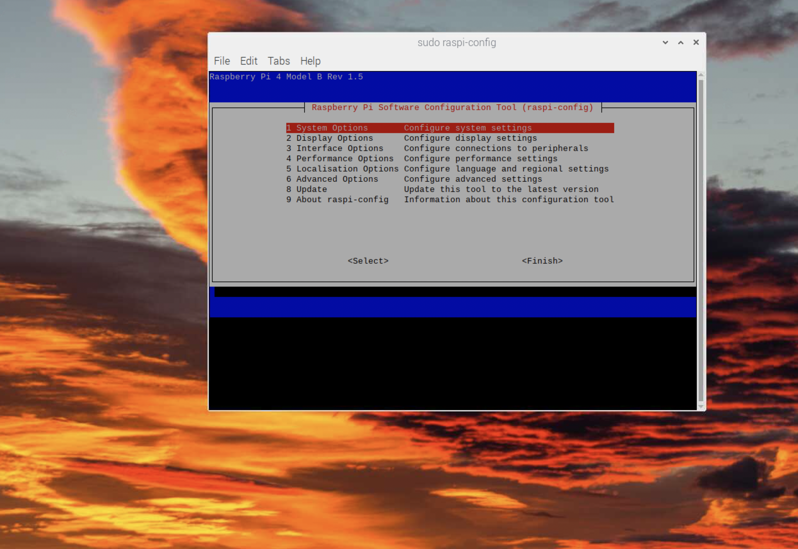
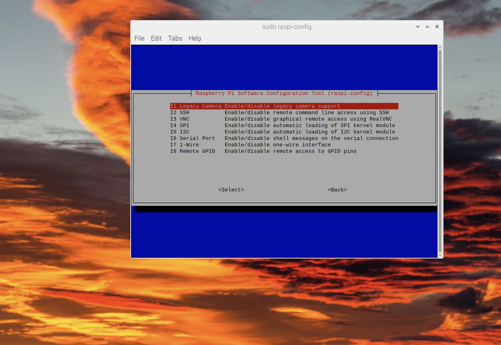
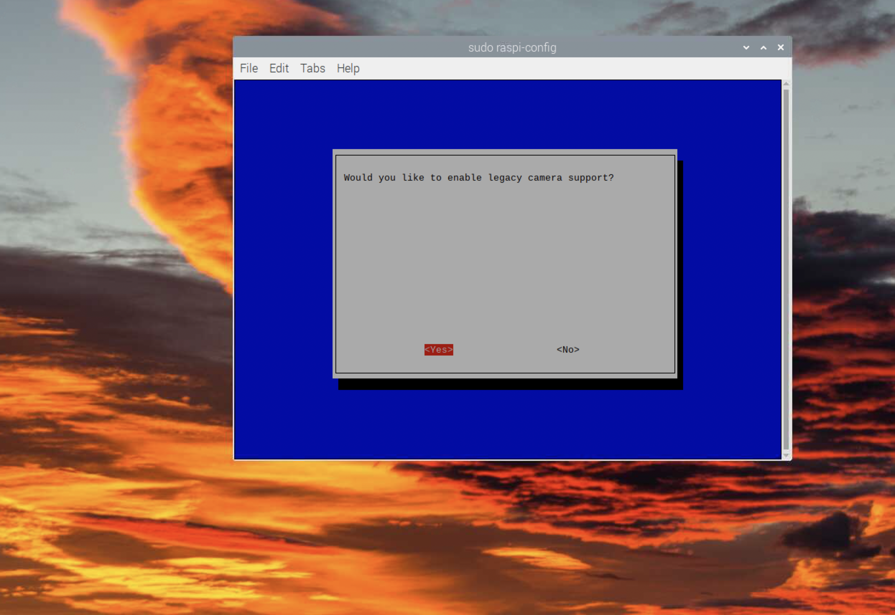

# Tensorflow + OpenCV
## Enable Camera support
First and formost a big thanks to this repository:

https://github.com/EdjeElectronics/TensorFlow-Lite-Object-Detection-on-Android-and-Raspberry-Pi/

This is where all the code and logic for implementing a tflite object detection module with opencv comes from.

First we will need to enable the camera for Raspberry Pi
Run the following command in the terminal and you will see a window like so

`sudo raspi-config`

The terminal will display a interface, use the arrow keys to navigate to the `Interface Options` option and hit `Enter`



Then, select enable Legacy Camera support






Finnaly reboot and we are ready to test the camera!

## Test Camera
Using the following command you can download a python file from this repo to test your camera.
You can run it by calling the command `python <name_of_file>` to close the camera click on the camera windo and then press the `q` key

```
wget https://raw.githubusercontent.com/sebcampos/HomeSecurityCamera/master/tensorflow_integration/video_capture_test.py
```
There should also be an output file where you ran the script called test.avi. This file is a video recording of what we just filmed
to open this file simply call `open test.avi` to delete it call `rm test.avi`.

Our test shows that it works, great, now lets download the tensorflow detection model from the [TensorFlow 2 Detection Model Zoo](https://github.com/tensorflow/models/blob/master/research/object_detection/g3doc/tf2_detection_zoo.md) and use the great code provided by [EdjeElectronics](https://github.com/EdjeElectronics/TensorFlow-Lite-Object-Detection-on-Android-and-Raspberry-Pi/)
to start out own object detection project.

I am using a model designed for devices like Raspberry pi which I got from the detection model zoo. If you would prefer to use that one then just follow
the intructions below
First we will make a folder to hold our model and labels

`mkdir model`

The we will move into the new model folder with the command cd

`cd model`

once inside we will download the two files from this repo using
```
wget https://raw.githubusercontent.com/sebcampos/HomeSecurityCamera/master/tensorflow_integration/model/detect.tflite
wget https://raw.githubusercontent.com/sebcampos/HomeSecurityCamera/master/tensorflow_integration/model/labelmap.txt
```
Now that this is done lets move up one directory and download out object detection test

```
cd ..
wget https://raw.githubusercontent.com/sebcampos/HomeSecurityCamera/master/tensorflow_integration/object_detection_test.py
```
now we can run the script. you should run the script from the same directory containing your `model` folder.
The file looks for a the model folder then opensthe detect.tflite and labelmap.txt files.

```
python object_detection_test.py
```
